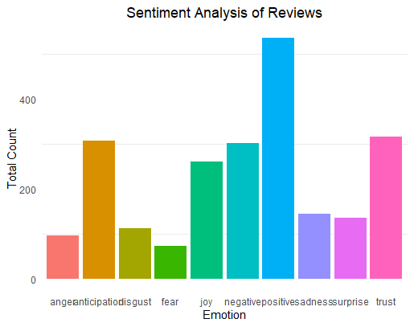

# Text Mining and Sentiment Analysis

## Objective
Analyze customer sentiment from product reviews using text mining techniques to provide actionable insights.

## Methodology
- **Text Preprocessing**: Tokenization, stop-word removal, stemming, and lemmatization.
- **Sentiment Analysis**: Used the `syuzhet` library in R to score sentiment across categories such as positive, negative, anger, and joy.
- **Visualization**: 
  - Word Cloud: Displays frequently used words.
  - Sentiment Bar Chart: Highlights the dominant sentiments across reviews.

## Results
- **Insights**:
  - The product received mostly positive feedback with high scores in categories such as "trust" and "joy."
  - Negative sentiment centered around delivery delays and product defects.
- **Key Visuals**:
  - **Word Cloud**:
    
  - **Sentiment Polarity**:
    
  - **Sentiment Distribution**:
    

## Tools
- **Programming Languages**:
  - R
- **Libraries Used**:
  - `tm`, `wordcloud`, `syuzhet`, `SnowballC`, `ggplot2`

## Dataset
- **ACBR.csv**: A sample dataset of customer reviews, including product names, review text, and ratings.

## Future Enhancements
- Extend the analysis to multiple product categories.
- Include topic modeling to identify themes within reviews.

## How to Run
1. Clone the repository:
   ```bash
   git clone https://github.com/AJ1522/text-mining-sentiment-analysis.git
2. Install dependencies:
   ```bash
   install.packages(c("tm", "wordcloud", "syuzhet", "ggplot2"))
3. Run the script in R studio
   
